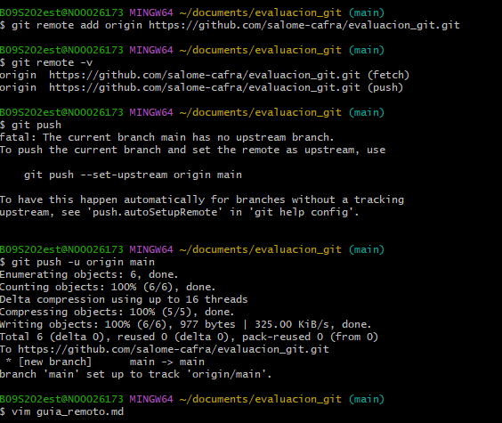

# procedimiento para crear el repositorio en GitHub 
- abri GitHub 
- hice clic en new repository 
- Escribi el nombre para el repositorio 
- por ultimo hice clic Create repository
## explicacion tecnica 
agregue al repositorio 
bash
git remote add origin URL_DEL_REPOSITORIO
con este comando conecte mi proyecto local con el repositorio de GitHub.
Subi el proyecto 
bash
git push -u origin main
Este comando envía los archivos a GitHub y deja configurada la rama principal.
## Comandos de uso diario
descargar los cambias del repositorio 
bash
git pull
Subir los cambios realizados:
bash
git push
Con estos dos comandos el repositorio local y el remoto se mantienen sincronizados.

